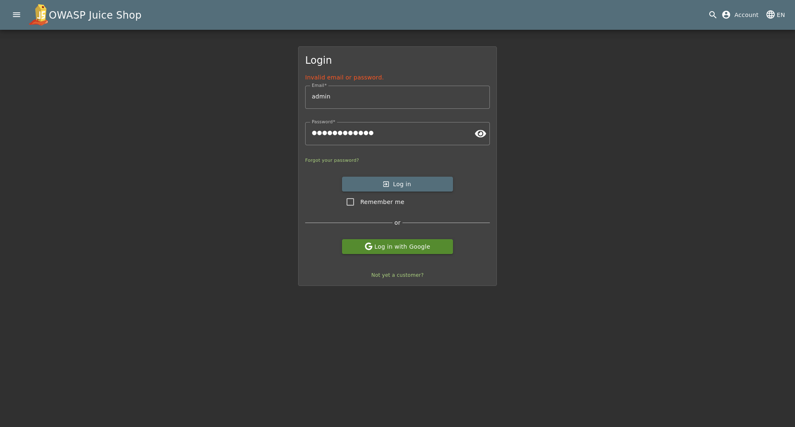
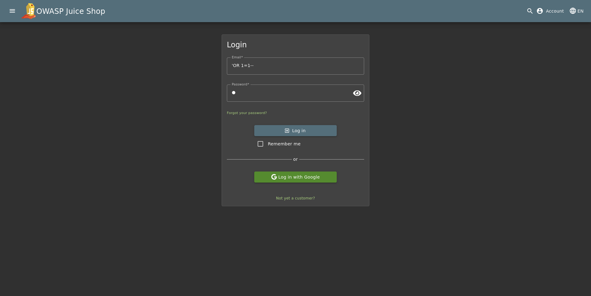
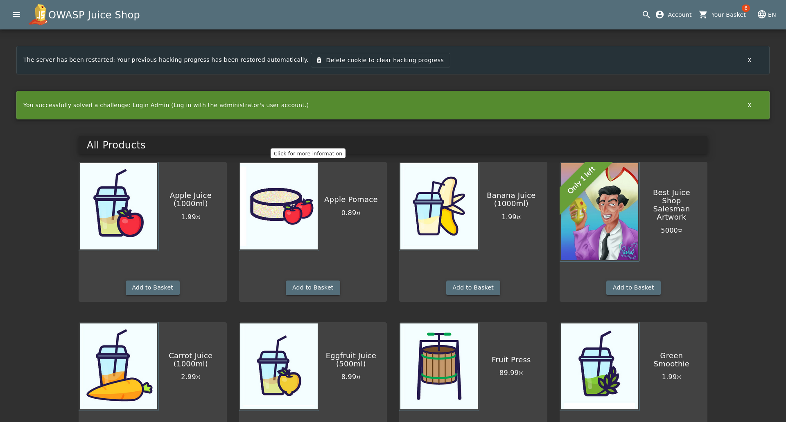
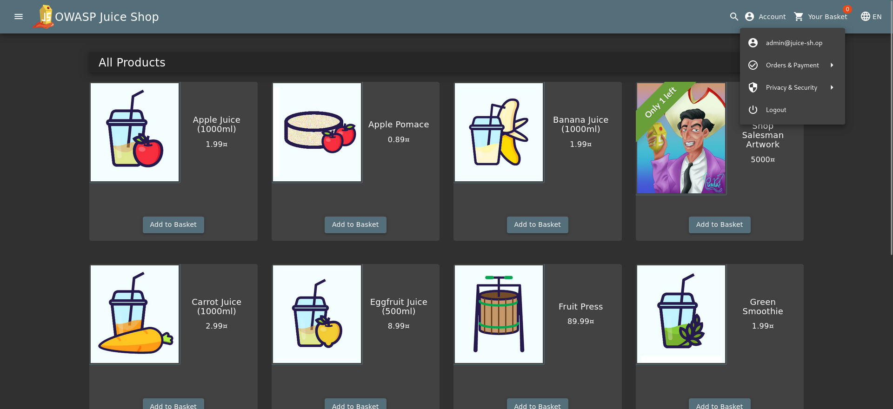

# SQL Injection Penetration Test Report – OWASP Juice Shop

**Prepared by:** Elroy Fernandes  
**Date:** January 13, 2026  

---

## Executive Summary

This report documents a successful SQL Injection attack against the OWASP
Juice Shop login functionality conducted in a controlled local environment.
The vulnerability allowed authentication bypass using a simple SQL payload,
granting unauthorized administrative access.

**Key Finding:** SQL Injection (CWE-89)  
**Severity:** Critical  
**Impact:** Full authentication bypass and administrative access  
**Status:** Proof of Concept Achieved  

---

## Scope and Objectives

### Scope
- **Application:** OWASP Juice Shop (intentionally vulnerable application)
- **Version:** v19.1.1
- **Environment:** Kali Linux (VM)
- **Target Component:** Login functionality
- **Testing Method:** Manual penetration testing

### Objectives
- Identify authentication vulnerabilities
- Demonstrate SQL Injection exploitation
- Document findings and remediation steps
- Showcase ethical security testing methodology

---

## Technical Finding: SQL Injection (Authentication Bypass)

### Description

The login form does not use parameterized queries or prepared statements when
validating user credentials. By injecting SQL syntax into the username field,
an attacker can manipulate the backend query logic to always evaluate as true,
resulting in authentication bypass.

---

## Steps to Reproduce (Proof of Concept)

### Step 1: Navigate to Login Page
<p align="center">
	
</p>

### Step 2: Inject SQL Payload

Enter the following payload into the Email/Username field:

```sql
' OR 1=1--
```
<p align="center">
	

### Step 3: Enter any arbitrary string in the Password field (e.g: SomethingPassword1)
### Step 4: Click Login
### Step 5: Result
The Application processes the query, ignores the password check due to the comment operator (--), and authenticates the user as the admin@juice-sh.op
<p align="center">
	
<p align="center">
	

### Impact
- **Severity:** Critical
- **Confidentiality:** High ( Access to all user data and PII)
- **Integrity:** High ( Ability to modify products, reviews, and user account)
- **Availability:** Medium ( Potential to delete records or drop tables)
  
---

## Technical Analysis
The SQL injection vulnerability exists because:
-**No Input Validation:** Username field accepts special SQL characters (‘, - -,etc.)
-**No Parameterized Queries:** Application uses string concatenation instead of prepared statements.

---

## Remediation recommendations

To prevent this, the development team should implement the following:
-**Use PreparedStatements:** This ensures the database treats the input as data only, not as executable code.
-**Input Validation:** Whitelist allowed characters in username field (alphanumeric + underscore only). Reject inputs containing SQL keywords (SELECT, OR, --,etc.)

---

## Conclusion
This penetration test successfully demonstrated a critical SQL injection vulnerability in the OWASP Juice shop authenticated mechanism. The vulnerability allows an unauthenticated attacker to bypass login controls and gain full administrative access using a simple payload. Implementation of parameterized queries and input validation will effectively remediate this issue. This assessment highlights the importance of secure coding practices and the need for regular security testing in application deployment.

-**Report Status:** Complete
-**Severity Level:** High
-**Remediation:** Timeline: Immediate


